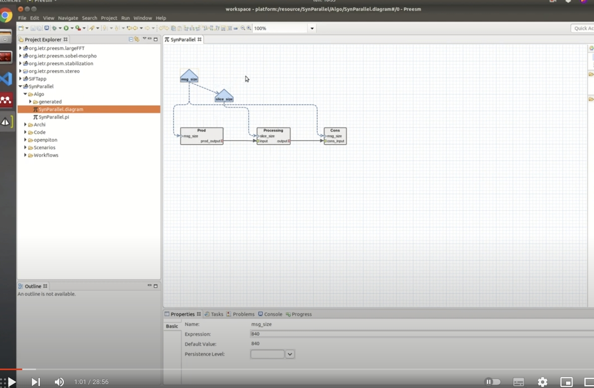

# Preesm to OpenPiton
Project that has the code for the Python script that convert Preesm generated application to run in OpenPiton

**Author**: Marcelo Ruaro, Kevin Martin

# Tutorial: How to Convert Preesm Apps. to OpenPiton

The tutorial was recorder in a form of a video a available at YouTube in the link below:

### **Video**: Step-by-step Installation from a Fresh Installation of Ubuntu 20: 
 

## Step 1: Application development on Preesm
The Preesm used in this tutorial was version 3.4. First you must develop your application on Preesm and generate it using any Preesm's workflow.

## Step 2: Use of preesm2openpiton script
The preesm2openpiton script available [here](https://github.com/Nooman-LabSTICC/nooman-openpiton/blob/master/bin/preesm2openpiton), can convert partially your Preesm application to a form that is amost executable in Openpition.

Note that the scripts doesn't do everything so it is necessary to manually modify the code to remove the compilation errors at Openpiton.

## Step 3: Pass the generated files to Openpiton directory

The preesm2openpiton script will generate two files:
* **preesm_defines.h**
  * Contains:
    1. The implementation of the functions of each actor
    2. The definition of structures
    3. Another important definitions and includes
* **preesm_main.c**
  * Contains:
    1. The declaration of the shared variables
    2. The implementation of the Preesm generated functions that represents the code of each threads: *computationThread_Core..*
    3. The **main** function, which detects the core id of the running core and call the respective functions. This procedure represents the execution of the threads, assigning to each core they respective thread execution, which in this case, is a call for the function *computationThread_Core..*

These two files need to be copied to Openpiton directory which holds the software codes.
* **preesm_defines.h**: copied to *nooman-openpiton/piton/verif/diag/assembly/include/riscv/ariane/*
  * Note that maybe (I never tried) this file can be pasted on the same directory of *preesm_main.c* below.
* **preesm_main.c**: copied to *nooman-openpiton/piton/verif/diag/c/riscv/ariane/*

## Step 4: Call the *openpiton* script to generate the HW and compile the SW

You must 
